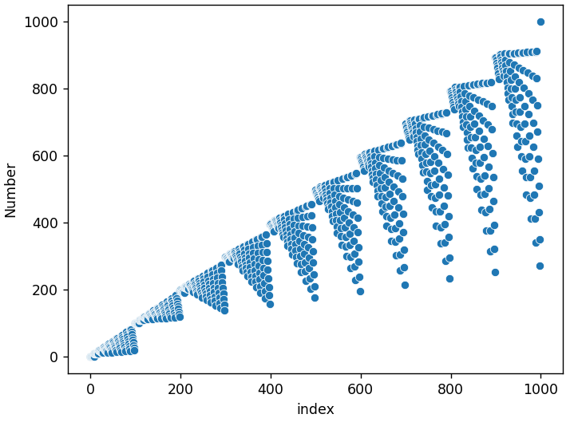
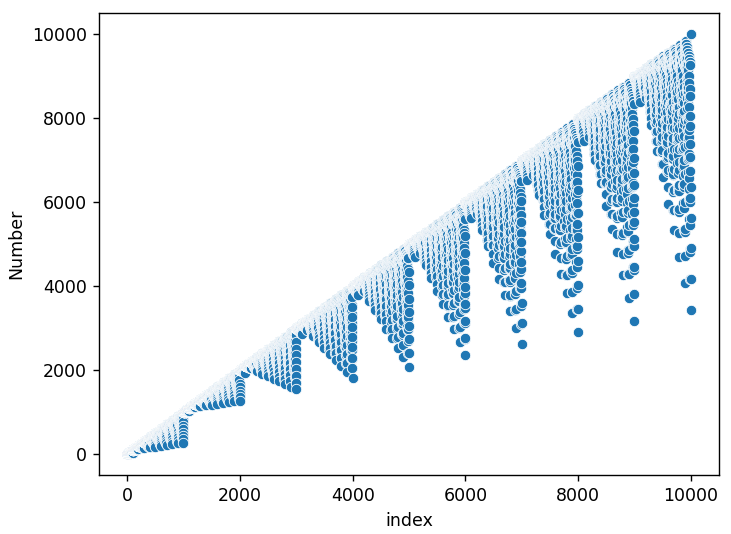
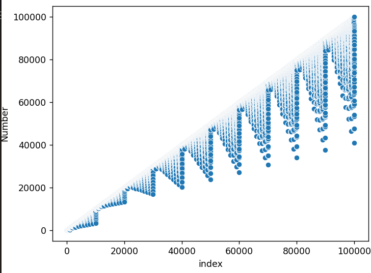
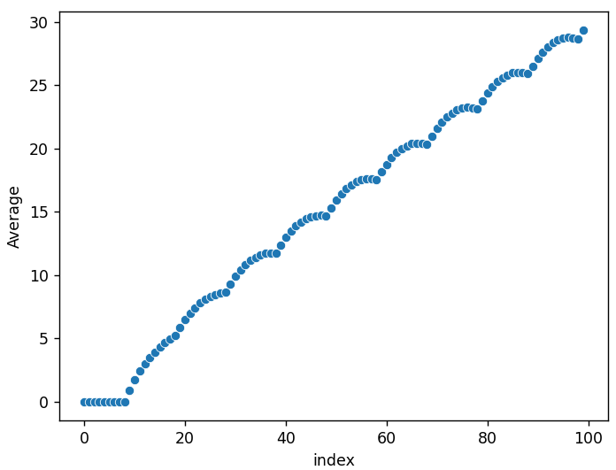
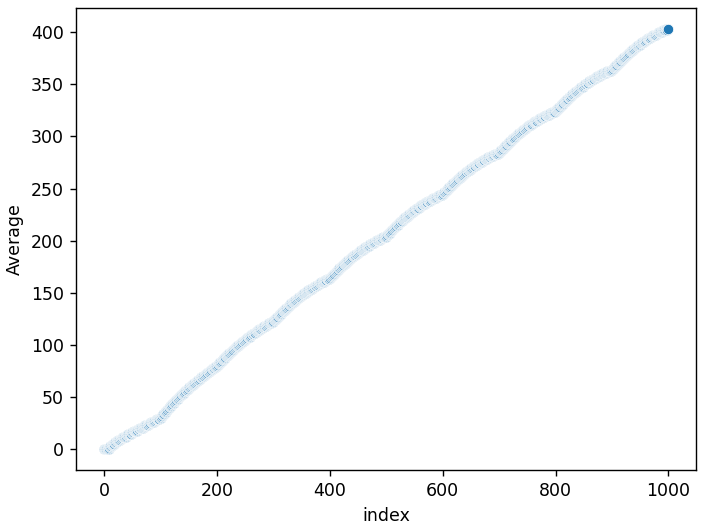
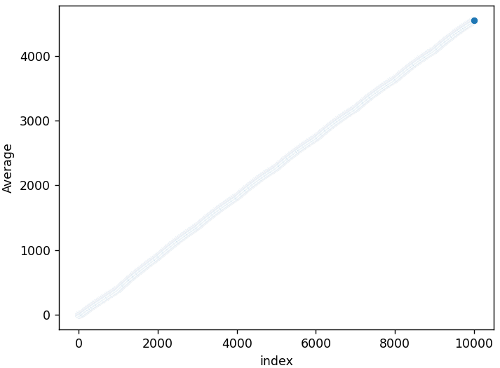
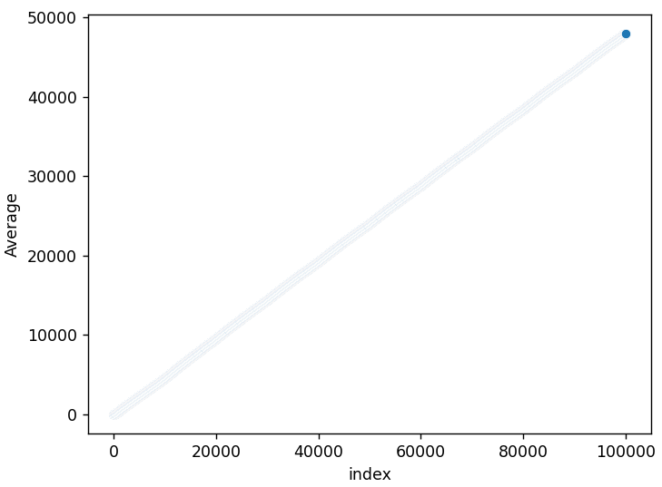

# wisteria-seqeunce
This script generates the [Wisteria sequence](https://www.youtube.com/watch?v=o8c4uYnnNnc). 

output: `[0, 0, 0, 0, 0, 0, 0, 0, 0, 9, 10, 10, 10, 10, 10, 10, 10, 10, 10, 18, 19, 18, 17, 16, 15, 14, 13, 12, 11, 27]`

# Plotting with Seaborn
## Basic Scatterplots
Scatterplot of 1000 numbers:

Scatterplot of 10,000 numbers:

Scatterplot of 100,000 numbers:

## Plotting the Average as $n \to \infty$
Scatterplot of the first 10 averages:

Scatterplot of the first 100 averages:

Scatterplot of the first 1,000 averages:

Scatterplot of the first 10,000 averages:

Scatterplot of the first 100,000 averages:
