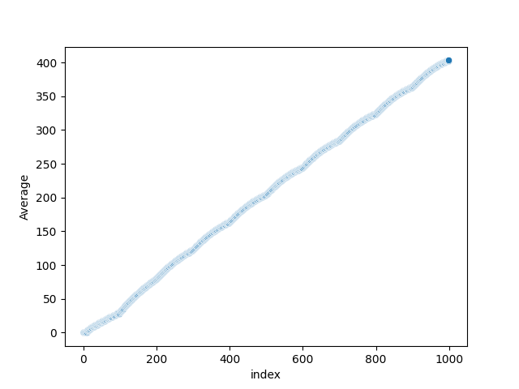
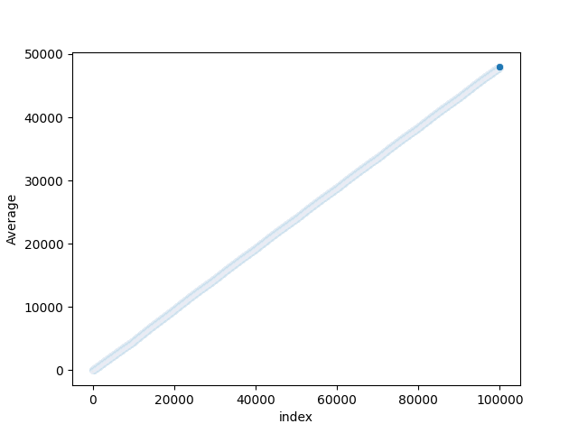

# wisteria-seqeunce
This script generates the [Wisteria sequence](https://www.youtube.com/watch?v=o8c4uYnnNnc). 

output: `[0, 0, 0, 0, 0, 0, 0, 0, 0, 9, 10, 10, 10, 10, 10, 10, 10, 10, 10, 18, 19, 18, 17, 16, 15, 14, 13, 12, 11, 27, 28, 26, 24, 22, 20, 18, 16, 14, 12, 36, 37, 34, 31, 28, 25, 22, 19, 16, 13, 45, 46, 42, 38, 34, 30, 26, 22, 18, 14, 54, 55, 50, 45, 40, 35, 30, 25, 20, 15, 63, 64, 58, 52, 46, 40, 34, 28, 22, 16, 72, 73, 66, 59, 52, 45, 38, 31, 24, 17, 81, 82, 74, 66, 58, 50, 42, 34, 26, 18, 99]`

# Plotting with Seaborn
## Basic Scatterplots
Scatterplot of 1000 numbers:

Scatterplot of 10,000 numbers:

Scatterplot of 100,000 numbers:

## Plotting the Average as $n \to \infty$
Scatterplot of the first 10 averages:

Scatterplot of the first 100 averages:

Scatterplot of the first 1,000 averages:

Scatterplot of the first 10,000 averages:

Scatterplot of the first 100,000 averages:
